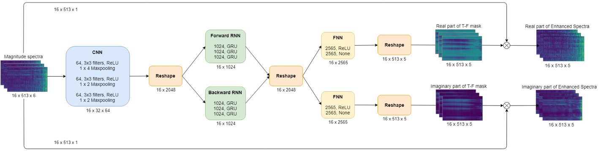

 
(Panorama image of Mt. Rainer in Washington USA.)

# Blind Source Separation

## Overview
Source separation, blind signal separation (BSS) or blind source separation, is the separation of a set of source signals from a set of mixed signals, without the aid of information (or with very little information) about the source signals or the mixing process.

Several approaches have been proposed for the solution of this problem but development is currently still very much in progress. Some of the more successful approaches are principal components analysis (PCA) and independent component analysis (ICA), which work well when there are no delays or echoes. [wikipedia](https://en.wikipedia.org/wiki/Signal_separation)

To overcome the limitation on these acoustic environments, we proposed to utilize deep learning methods based on [this paper](https://arxiv.org/pdf/1502.04149.pdf) which can be robust to noise and reverberation.

The whole project will involve several tasks:

* Extract the time-frequency features from time domain audio clips (`mir_extract_feature.py`).

* Define deep learning model and hyper-parameters (`model.py`).

* Define generator to generate batched data and solver to provide training and testing interface (`utils.py`).

* Demo training and inference methods (`train.py` and `inference.py`).